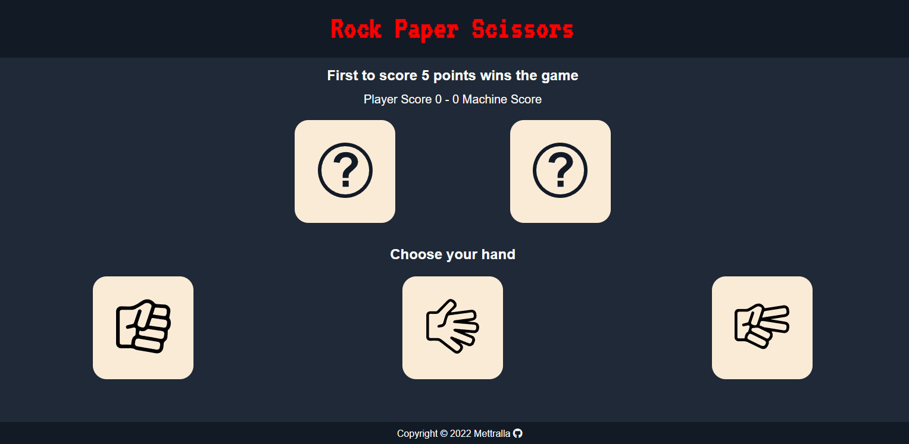

 </a>

<h3 align="center">Juego de Piedra, Papel y Tijera</h3>

---

Este es mi primer proyecto usando HTML, CSS y JavaScript como práctica de uso del DOM. Se trata de un simple juego de piedra, papel o tijera en el que el usuario juega contra la computadora. Este proyecto forma parte de la curricula de The Odin Project.
  

---

## 📝 Tabla de Contenidos
- [¿Como funciona?](#funcionamiento)
- [¿Como lo he hecho?](#desarrollo)
- [¿Como puedo probarlo?](#probarlo)
- [Vista Previa](#vista)
- [¿Que he aprendido?](#aprendido)
- [Autor](#authors)

## 🧐 ¿Como Funciona? 

Cuando el usuario selecciona una opción (piedra, papel o tijera), el programa compara su elección con la elección de la computadora y determina quién gana. Si el usuario gana, se muestra un mensaje de victoria; si pierde, se muestra un mensaje de derrota; y si hay un empate, se muestra un mensaje de empate.

## ⛏️ ¿Como lo he hecho? 

Para desarrollar este proyecto, he utilizado HTML para crear la estructura básica de la página y CSS para darle estilo. También he utilizado JavaScript para implementar la lógica del juego y manipular el DOM.

En concreto, he utilizado las siguientes herramientas y técnicas:

- Event listeners para detectar cuándo el usuario hace clic en una opción.
- Funciones para generar aleatoriamente la elección de la computadora.
- Condiciones if-else para comparar las elecciones del usuario y la computadora y determinar el ganador.
- Manipulación del DOM para mostrar mensajes de victoria, derrota o empate.

## 🏁 ¿Como puedo probarlo? 

Si quieres probar este juego por ti mismo, puedes hacer lo siguiente:

- Descarga o clona este repositorio.
- Abre el archivo index.html en tu navegador web.
- Juega contra la computadora y diviértete!

Tambien puedes probarlo haciendo haciendo click [aqui](https://mettralla.github.io/rock-paper-scissors/).

## 🎈 Vista Previa 

- Ventana Principal

## 💡 ¿Qué he aprendido? 

Al hacer este proyecto, he aprendido muchas cosas, incluyendo:

- Cómo utilizar el DOM para manipular elementos HTML y CSS.
- Cómo generar aleatoriamente números y utilizarlos para tomar decisiones.
- Cómo utilizar condiciones if-else para comparar valores y tomar decisiones.
- Cómo utilizar funciones para modularizar el código y hacerlo más legible y reutilizable.

## ✍️ Autor 
- Daniel Tejerina ([@mettralla](https://github.com/mettralla)) - [Linkedin](https://www.linkedin.com/in/daniel-alejandro-tejerina/)
